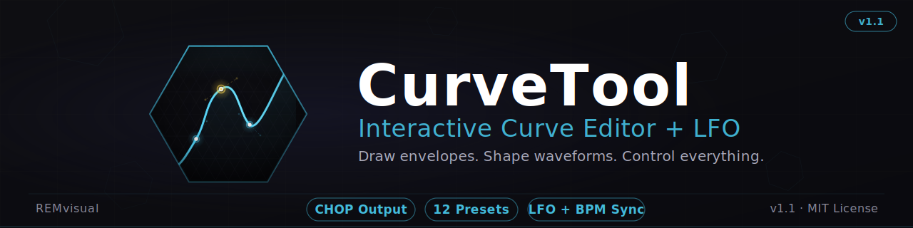

# td-CurveTool

**Interactive Curve Editor + LFO for TouchDesigner 2025.x**

## Why This Exists

Drawing custom envelopes and waveform shapes in TouchDesigner means wrestling with keyframes, Animation COMPs, or external tools. td-CurveTool gives you a self-contained curve editor that lives inside any COMP. You draw the shape you want, and the output feeds directly into a Lookup CHOP driven by any timing source -- LFO, beat, timeline, or external signal.

## Features

- **Custom curve CHOP output** -- your drawn curve is output as a Script CHOP (default 256 samples), ready to wire into a Lookup CHOP driven by any timing source
- **Single-pass rendered UI** -- the entire interface (curve, grid, toolbar, dropdown, 7-segment display) is drawn in one shader. No TOPs stacked, no UI widgets.
- **Per-point bezier/linear toggle** -- click any control point to switch between smooth spline and linear interpolation
- **12 built-in presets** -- linear, sine, triangle, sawtooth, sawtooth reverse, square, ease in/out, exponential attack/decay, S-curve
- **Dropdown preset picker** -- rendered dropdown with hover highlighting and bitmap font labels
- **Save and reset** -- save the current curve as a user preset, reset to default
- **LFO time controls** -- speed slider (logarithmic 0.01--20 Hz), BPM sync mode (30--300 BPM)
- **RAMP / PING mode** -- toggle between one-shot ramp and ping-pong bounce
- **7-segment value display** -- real-time numeric readout rendered in the shader
- **Replicable .tox** -- drop copies into any project; each instance is fully isolated

## Quick Start

1. Open **TouchDesigner 2025.x**
2. Drag `RAMP_V1.1.tox` into your project
3. Done -- the curve editor is ready to use

### Wire the Output

The `curve_output` Script CHOP outputs your curve shape (default 256 samples). Connect it to a **Lookup CHOP**:

1. Create a **Lookup CHOP**
2. Wire **Input 0** to any 0-to-1 source (LFO CHOP, Beat CHOP, Timeline, etc.)
3. Wire **Input 1** to `curve_output`
4. The Lookup CHOP outputs your source shaped by the curve

## Interaction

| Action | Result |
|---|---|
| **Double-click** empty area | Add a control point |
| **Click** a point (no drag) | Toggle bezier / linear for that segment |
| **Drag** a point | Move it (endpoints locked to x=0 and x=1) |
| **Right-click** a point | Delete it (minimum 2 points enforced) |

### Toolbar

| Control | Description |
|---|---|
| **Preset dropdown** | Select from 12 built-ins + saved user presets |
| **SAVE** | Save current curve as a user preset |
| **RST** | Reset to default linear ramp |
| **SYNC** | Toggle between free-running Hz and BPM sync |
| **Speed slider** | Drag to set LFO speed (logarithmic scale) |
| **Eye toggle** | Show/hide LFO overlay (green scanline + tracking dot) |
| **RAMP / PING** | Toggle between ramp and ping-pong bounce mode |

## Requirements

- **TouchDesigner 2025.x** (tested with 2025.20000+)

## Version

**v1.1** -- Toolbar, dropdown preset picker, 7-segment display, LFO time controls, RAMP/PING mode toggle.

## License

MIT -- see [LICENSE](LICENSE)

Copyright 2026 REMvisual
